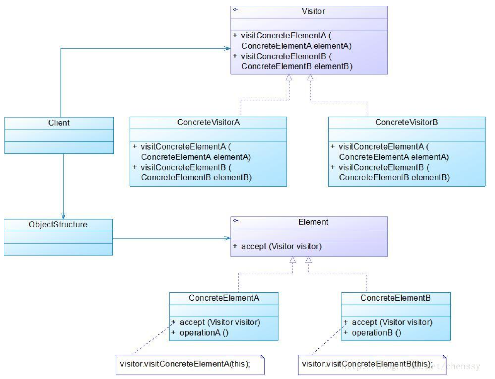

在访问者模式中：

http://blog.csdn.net/chenssy/article/details/12029633

角色：
Vistor: 抽象访问者。为该对象结构中的**concreteElement的每一个类声明的一个操作**。 
ConcreteVisitor: 具体访问者。实现Visitor申明**一个操作**，其它的为空实现，每一个操作实现算法的一部分。 

Element: 抽象元素。定义一个Accept操作，它以一个访问者为参数。 
ConcreteElement: 具体元素 。实现Accept操作。 
ObjectStructure: 对象结构。能够枚举它的元素

形成  visitors  和 elements 的组合。  多对多
Visitor中定义所有visit(ConcreteElement)抽象方法
Element中定义抽象accept(Visitor)方法。

